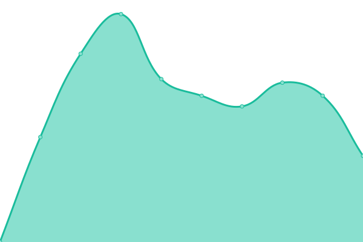

# [📈 Live Status](https://demo.upptime.js.org): <!--live status--> **🟩 All systems operational**

This repository contains the open-source uptime monitor and status page for [SquashedPie](https://demo.upptime.js.org), powered by [Upptime](https://github.com/upptime/upptime).

With [Upptime](https://upptime.js.org), you can get your own unlimited and free uptime monitor and status page, powered entirely by a GitHub repository. We use [Issues](https://github.com/s3ase/squashed/issues) as incident reports, [Actions](https://github.com/s3ase/squashed/actions) as uptime monitors, and [Pages](https://demo.upptime.js.org) for the status page.

<!--start: status pages-->
<!-- This summary is generated by Upptime (https://github.com/upptime/upptime) -->
<!-- Do not edit this manually, your changes will be overwritten -->
<!-- prettier-ignore -->
| URL | Status | History | Response Time | Uptime |
| --- | ------ | ------- | ------------- | ------ |
|  [Motheo Website](https://www.motheotvet.edu.za) | 🟩 Up | [motheo-website.yml](https://github.com/s3ase/squashed/commits/HEAD/history/motheo-website.yml) | 

 2542ms
     
 | 

<a href="https://s3ase.github.io/squashed/history/motheo-website">100.00%</a>
    

|  Motheo Security | 🟩 Up | [motheo-security.yml](https://github.com/s3ase/squashed/commits/HEAD/history/motheo-security.yml) | 

 2420ms
     
 | 

<a href="https://s3ase.github.io/squashed/history/motheo-security">100.00%</a>
    

|  Motheo Artisan | 🟩 Up | [motheo-artisan.yml](https://github.com/s3ase/squashed/commits/HEAD/history/motheo-artisan.yml) | 

 231ms
     
 | 

<a href="https://s3ase.github.io/squashed/history/motheo-artisan">99.89%</a>
    

|  Motheo Bloemfontein | 🟩 Up | [motheo-bloemfontein.yml](https://github.com/s3ase/squashed/commits/HEAD/history/motheo-bloemfontein.yml) | 

 237ms
     
 | 

<a href="https://s3ase.github.io/squashed/history/motheo-bloemfontein">91.74%</a>
    

|  Motheo BOTSHABELO | 🟩 Up | [motheo-botshabelo.yml](https://github.com/s3ase/squashed/commits/HEAD/history/motheo-botshabelo.yml) | 

 242ms
     
 | 

<a href="https://s3ase.github.io/squashed/history/motheo-botshabelo">97.42%</a>
    

|  Motheo Central Office | 🟩 Up | [motheo-central-office.yml](https://github.com/s3ase/squashed/commits/HEAD/history/motheo-central-office.yml) | 

 236ms
     
 | 

<a href="https://s3ase.github.io/squashed/history/motheo-central-office">0.00%</a>
    

|  Motheo Hillside View | 🟩 Up | [motheo-hillside-view.yml](https://github.com/s3ase/squashed/commits/HEAD/history/motheo-hillside-view.yml) | 

 252ms
     
 | 

<a href="https://s3ase.github.io/squashed/history/motheo-hillside-view">100.00%</a>
    

|  Motheo Incubator | 🟩 Up | [motheo-incubator.yml](https://github.com/s3ase/squashed/commits/HEAD/history/motheo-incubator.yml) | 

 237ms
     
 | 

<a href="https://s3ase.github.io/squashed/history/motheo-incubator">52.13%</a>
    

|  Motheo Koffiefontein | 🟩 Up | [motheo-koffiefontein.yml](https://github.com/s3ase/squashed/commits/HEAD/history/motheo-koffiefontein.yml) | 

 237ms
     
 | 

<a href="https://s3ase.github.io/squashed/history/motheo-koffiefontein">96.24%</a>
    

|  Motheo Mechanical Skills | 🟩 Up | [motheo-mechanical-skills.yml](https://github.com/s3ase/squashed/commits/HEAD/history/motheo-mechanical-skills.yml) | 

 260ms
     
 | 

<a href="https://s3ase.github.io/squashed/history/motheo-mechanical-skills">99.57%</a>
    

|  Motheo Plot 32 | 🟩 Up | [motheo-plot-32.yml](https://github.com/s3ase/squashed/commits/HEAD/history/motheo-plot-32.yml) | 

 243ms
     
 | 

<a href="https://s3ase.github.io/squashed/history/motheo-plot-32">99.13%</a>
    

|  Motheo Thaba Nchu | 🟩 Up | [motheo-thaba-nchu.yml](https://github.com/s3ase/squashed/commits/HEAD/history/motheo-thaba-nchu.yml) | 

 245ms
     
 | 

<a href="https://s3ase.github.io/squashed/history/motheo-thaba-nchu">89.53%</a>
    

|  Motheo Zastron | 🟩 Up | [motheo-zastron.yml](https://github.com/s3ase/squashed/commits/HEAD/history/motheo-zastron.yml) | 

 238ms
     
 | 

<a href="https://s3ase.github.io/squashed/history/motheo-zastron">99.49%</a>
    

<!--end: status pages-->

[**Visit our status website →**](https://demo.upptime.js.org)

## 📄 License

- Powered by: [Upptime](https://github.com/upptime/upptime)
- Code: [MIT](./LICENSE) © [Anand Chowdhary](https://anandchowdhary.com), supported by [Pabio](https://pabio.com)
- Data in the `./history` directory: [Open Database License](https://opendatacommons.org/licenses/odbl/1-0/)
